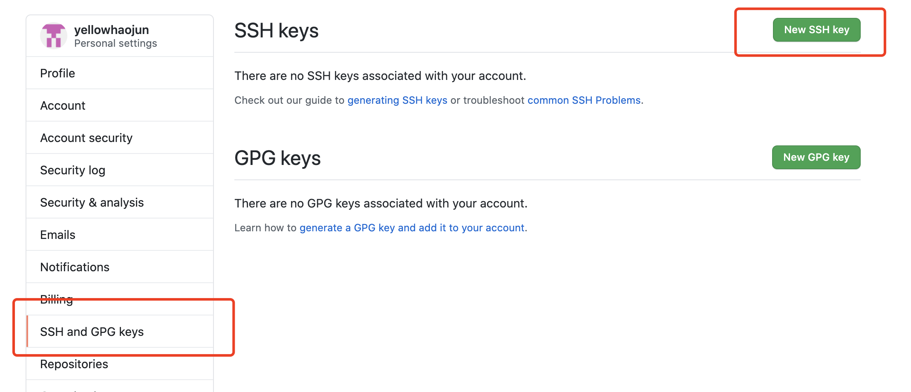
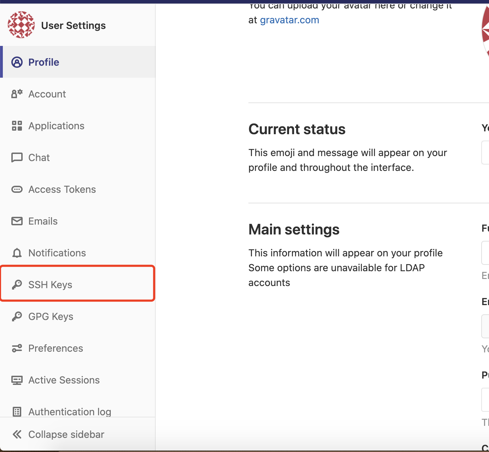

# 使用SSH拉去代码

## 生成ssh key

使用`ssh-keygen`命令生成命令, 不输入`-f`后面的内容会默认生成到`./ssh`当中

```bash
ssh-keygen -t rsa -C 'yourEmail@xx.com' -f ~/.ssh/zkt_id_rsa
```

## 复制ssh key

复制ssh key到`github`或`gitlab`, 打开个人中心

GitHub:



Gitlab:



复制生成的`.pub`后缀文件内容（公钥）到github 或者 gitlab上

## config文件

在`~/.ssh`目录下新建名称为config的文件(无后缀名)，用于配置多个不同host使用不同的ssh key

```bash
# gitlab
Host gitlab.com
    HostName gitlab.com
    PreferredAuthentications publickey
    IdentityFile ~/.ssh/gitlab_id-rsa
    
# github
Host github.com
    HostName github.com
    PreferredAuthentications publickey
    IdentityFile ~/.ssh/github_id-rsa
  
# 配置文件参数
# Host : Host可以看作是一个你要识别的模式，对识别的模式，进行配置对应的的主机名和ssh文件
# HostName : 要登录主机的主机名
# User : 登录名
# IdentityFile : 指明上面User对应的identityFile路径
```

## 验证ssh key

`git@`后面是`HostName`

```bash
ssh -T git@gitlab.com
```

