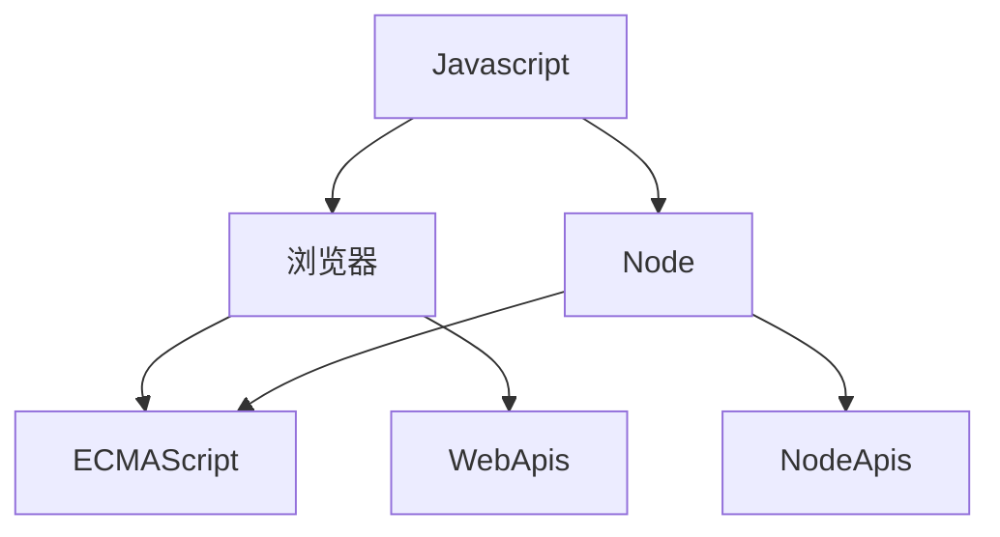

# ECMAScript 新特性

## ECMAScript与Javascript的关系

>  ECMAScript 可以看作Javascript的扩展规范，ECMAScript只是提供了基本的语法，比如说for，let，const等，Javascript是一门通用脚本语言，它遵循了ECMAScript的语言标准，换句话说Javascript是ECMAScript的扩展语言

Javascript 如果在浏览器当中，使用了ECMAScript的语法和提供了WebApis（比如我们常用BOM和DOM），而在Node环境当中则是使用ECMAScript的语法和NodeApis（比如常用的fs、net、http模块）

## ECMAScript 6

> 这个版本的 ECMAScript 将它的名字从 ES6 改为了 ES2015，因为 Ecma International 决定每年发布 ECMAScript，并根据发布的年份进行命名。简单地说，ES6 与 ES2015 指定是同一个 ECMAScript 版本

ES2016相对前几个版本来说这个版本的改动会比较大，这版本距离上一个版本发布相距了6年的时间，这个版本主要是修改了以下几点:

1. 解决原有语法上的一些问题或者不足
2. 对原有语法进行增强
3. 全新的对象、全新的方法、全新的功能
4. 全新的数据类型和数据结构

### 新特性

## ECMAScript 7

## ECMAScript 8

## ECMAScript 9

