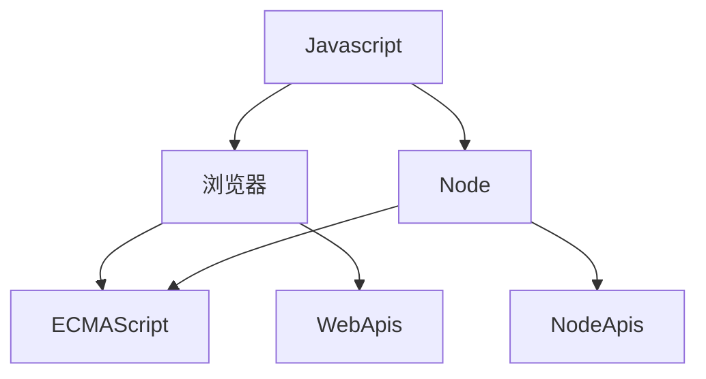

# ECMAScript 新特性

## ECMAScript与Javascript的关系

>  ECMAScript 可以看作Javascript的扩展规范，ECMAScript只是提供了基本的语法，比如说for，let，const等，Javascript是一门通用脚本语言，它遵循了ECMAScript的语言标准，换句话说Javascript是ECMAScript的扩展语言



Javascript 如果在浏览器当中，使用了ECMAScript的语法和提供了WebApis（比如我们常用BOM和DOM），而在Node环境当中则是使用ECMAScript的语法和NodeApis（比如常用的fs、net、http模块）

## ECMAScript 6

### 总结

> 这个版本的 ECMAScript 将它的名字从 ES6 改为了 ES2015，因为 Ecma International 决定每年发布 ECMAScript，并根据发布的年份进行命名。简单地说，ES6 与 ES2015 指定是同一个 ECMAScript 版本

ES2016相对前几个版本来说这个版本的改动会比较大，这版本距离上一个版本发布相距了6年的时间，这个版本主要是修改了以下几点:

1. 解决原有语法上的一些问题或者不足
2. 对原有语法进行增强
3. 全新的对象、全新的方法、全新的功能
4. 全新的数据类型和数据结构

### 新特性

#### let 与 块级作用域

> 在此之前，ES只有全局作用域和函数作用域，ES6种新增了块级作用域

例子1：

```js
if (true) {
  var foo1 = 'foo'
}
console.log(foo1) // 'foo'


if (true) {
  let foo2 = 'foo'
}
console.log(foo2) // foo is not defined
```

简单点来讲 { } 内就属于一个块，而这个作用域的作用就只在{}内，当我们使用var定义的时候，属于全局作用域，而使用let就成了块级作用域，所以foo1输出'foo'，而foo2会输出error foo is not defined

例子2:

let不存在变量提升

```js
console.log(foo)
let foo = 'foo'
```

例子3：

在for循环当中如果使用了var去定义了两个相同的变量，会产生覆盖效果，最终我们只会得到一次输出

```js
for (var i = 0; i < 3; i++) {
  for (var i = 0; i < 3; i++) {
    console.log(i)
  }
  console.log('内层结束 i = ' + i)
}
```

而如果我们使用了let取定义的话，是不会产生覆盖的效果，最终可以得到我们想得到的效果

例子4:

```js
for (var i = 0; i < 3; i++) {
  for (let i = 0; i < 3; i++) {
    console.log(i)
  }
  console.log('内层结束 i = ' + i)
}
```

即使let不会产生副作用，但为了代码的可读性，还是建议使用不同的变量去处理

列子5：

下面的代码执行之后，会发现得不到正确的索引

```js
var elements = [{}, {}, {}]

for (var i = 0; i < elements.length; i++) {
  elements[i].onclick = function () {
    console.log(i)
  }
}

elements[1].onclick() // 3
```

我们希望得到正确的索引的值，我们可以使用必包，使用函数作用域去解决当前的问题

```js
var elements = [{}, {}, {}]

for (var i = 0; i < elements.length; i++) {
  elements[i].onclick = (function (i) {
    return function() {
      console.log(i)
    }
  })(i)
}

elements[1].onclick()
```

其实这里更简单的解决方法是使用let

```js
var elements = [{}, {}, {}]

for (var i = 0; i < elements.length; i++) {
  elements[i].onclick = function () {
    console.log(i)
  }
}

elements[1].onclick()
```

例子6：

在ES6之前的，也存在着隐形的块级作用域

```js
try {
  undefined()
} catch (err) {
  console.log(err)
}
console.log(err) // error
```

#### const

> const 是用于定义常量的，修改后是不允许修改，这里的不允许修改指得是不允许修改变量内存地址 

```js
// 修改了内存地址
const a = '123'
a = '123' // error

// 不允许发开定义值，必须初始化值
const name
name = '123' // error

// 修改了内存推内的值
const obj = {
  name: '123'
}

obj.name = '456'
console.log(obj.name) // 456
```

#### 展开语法（...）

> 展开语法可以应用在参数、数组当中

列子1:

当我们想分别输出数组中的每一值到控制台的时候，我们可以分别去取出这里的每一个值

```js
const arr = [1, 2, 3]
const foo = arr[0]
const bar = arr[1]
const baz = arr[2]
console.log(foo, bar, baz) // 1 2 3
```

但当我们数组的位数是一个未知数的时候，我们可以使用apply

```js
const arr = [1, 2, 3]
console.log.apply(console, arr) // 1 2 3
```

在ES6当中我们可以直接使用展开符，进行相关的处理

```js
const arr = [1, 2, 3]
console.log(...arr) // 1 2 3
```

例子2:

展开语法还可以使用在参数

```js
var arr = [1, 2, 3]
function myConsole (...args) {
  console.log.apply(console, args)
}

myConsole(arr) // [1, 2, 3]
```

应用到入参当中，使用了...args 相当于把arguments的值变成了一个数组的参数传入。

如果需要使用输出一个1 2 3，我们可以把展开语法应用在调用当中

```js

var arr = [1, 2, 3]
function myConsole (...args) {
  console.log.apply(console, ...args)
}

myConsole(arr) // 1 2 3
```

列子3:

展开语法应用在对象当中

```js
const obj1 = { name: 'alex' }
const obj2 = { name: 'jack', age: 18 }
const obj3 = { ...obj1, ...obj2 }
console.log(obj3) // { name: 'jack', age: 18 }
```

#### 结构

例子1:

数组的结构附值

当我们需要取出数组中的第1、2、3位值的时候，可能会这么写

```js
const arr = [1, 2, 3]

const foo = arr[0]
const bar = arr[1]
const baz = arr[2]

console.log(foo, bar, baz) // 1 2 3
```

使用ES6的语法，可以节约不少的代码，定义的参数分别对应的着数组当中的下标

```js
const arr = [1, 2, 3]
const [foo, bar, baz] = arr
console.log(foo, bar, baz) // 1 2 3
```

假如我们不希望获取前两个值，只获取最后一个值（使用,分割）

```js
const arr = [1, 2, 3]
const [, , baz] = arr

console.log(baz) // 3
```

设置默认的值，使用等号设置默认值

```js
const arr = [1, 2]
const [, , baz = 4] = arr
console.log(baz) // 4
```

列子2:

对象的结构附值

除了数组的结构附值外，对象也可是使用结构结构附值，与数组类似，但是取值的是使用Object的key的值

```js
const obj = { name: 'alex', age: 19 }

const { name, age } = obj

console.log(name, age) // 'alex' 19
```

设置默认值，与数组的结构附值类似，使用=

```js
const obj = { name: 'alex', age: 19 }

const { name, age, gender = 'man' } = obj

console.log(name, age, gender)
```

设置别名，有的时候结构附值的变量名与全局变量的名字重复，这个时候可以设置别名

```js
const obj = { name: 'alex', age: 19 }
const name = 'jack'

const { name: objName, age, gender = 'man' } = obj

console.log(name, age, gender, objName)
```

设置了别名后，依然可以使用=设置默认值

```js
const obj = { age: 19 }
const name = 'jack'

const { name: objName = 'alex', age, gender = 'man' } = obj

console.log(name, age, gender, objName)
```

#### 模版字符串

模版字符串可以使我们处理一些事物更加简单

例子1：

使字符串拼接更加简单

```js
const name = 'alex'
const a = `hello ${name}` // hello alex
```

需要使用``需要使用转意字符处理

```js
const name = 'alex'
const a = `hello ${name} \`abc\`` // hello alex `abc`
```

模版字符串支持多行，在过去换行需要使用\n，在这里不需要使用

```js
const name = 'alex'
const a = `hello ${name} \`abc\`
  abc
` // hello alex `abc`
	//   abc
```

${}内史Js表达式，可以使用函数或者计算表达式

```js
const name = 'alxe'
const a = `hello ${name} ${1+1} ${Math.random()` // hello alex 2 ${随机数}
```

例子2:

标签模版字符串

```js
const name = 'tom'
const gender = false
function myTagFunc (strings, name, gender) {
  // strings [ 'hey, ', ' is a ', '' ]
  // name tom
  // gender false
  const sex = gender ? 'man' : 'woman'
  return strings[0] + name + strings[1] + sex + strings[2]
}

const result = myTagFunc`hey, ${name} is a ${gender}`
console.log(result) // hey, tom is a woman
```

标签模版字符串可以理解为这是一个函数，第一个参数strings包含所有的静态字符串，以表达式变量进行分割成数组（类似split('$')的效果）；然后逐一解析变量表达式，传到对应的参数name和gender

#### 字符串的扩展方法

