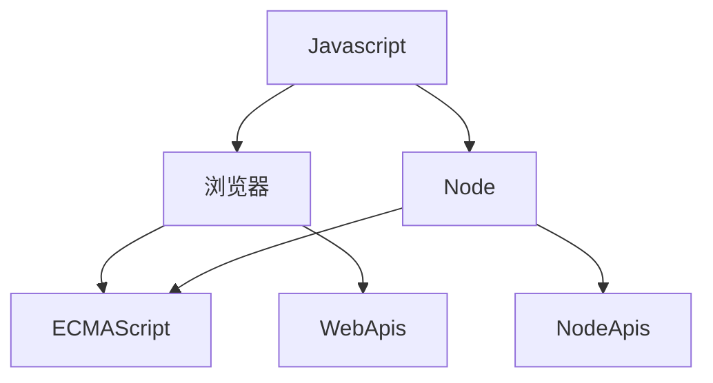

# ECMAScript 新特性

## ECMAScript与Javascript的关系

>  ECMAScript 可以看作Javascript的扩展规范，ECMAScript只是提供了基本的语法，比如说for，let，const等，Javascript是一门通用脚本语言，它遵循了ECMAScript的语言标准，换句话说Javascript是ECMAScript的扩展语言



Javascript 如果在浏览器当中，使用了ECMAScript的语法和提供了WebApis（比如我们常用BOM和DOM），而在Node环境当中则是使用ECMAScript的语法和NodeApis（比如常用的fs、net、http模块）

## ECMAScript 6

### 总结

> 这个版本的 ECMAScript 将它的名字从 ES6 改为了 ES2015，因为 Ecma International 决定每年发布 ECMAScript，并根据发布的年份进行命名。简单地说，ES6 与 ES2015 指定是同一个 ECMAScript 版本

ES2016相对前几个版本来说这个版本的改动会比较大，这版本距离上一个版本发布相距了6年的时间，这个版本主要是修改了以下几点:

1. 解决原有语法上的一些问题或者不足
2. 对原有语法进行增强
3. 全新的对象、全新的方法、全新的功能
4. 全新的数据类型和数据结构

### 新特性

#### let 与 块级作用域

在此之前，ES只有全局作用域和函数作用域，ES6种新增了块级作用域

例子1：

```js
if (true) {
  var foo1 = 'foo'
}
console.log(foo1) // 'foo'


if (true) {
  let foo2 = 'foo'
}
console.log(foo2) // foo is not defined
```

简单点来讲 { } 内就属于一个块，而这个作用域的作用就只在{}内，当我们使用var定义的时候，属于全局作用域，而使用let就成了块级作用域，所以foo1输出'foo'，而foo2会输出error foo is not defined

例子2:

let不存在变量提升

```js
console.log(foo)
let foo = 'foo'
```

例子3：

在for循环当中如果使用了var去定义了两个相同的变量，会产生覆盖效果，最终我们只会得到一次输出

```js
for (var i = 0; i < 3; i++) {
  for (var i = 0; i < 3; i++) {
    console.log(i)
  }
  console.log('内层结束 i = ' + i)
}
```

而如果我们使用了let取定义的话，是不会产生覆盖的效果，最终可以得到我们想得到的效果

例子4:

```js
for (var i = 0; i < 3; i++) {
  for (let i = 0; i < 3; i++) {
    console.log(i)
  }
  console.log('内层结束 i = ' + i)
}
```

即使let不会产生副作用，但为了代码的可读性，还是建议使用不同的变量去处理

列子5：

下面的代码执行之后，会发现得不到正确的索引

```js
var elements = [{}, {}, {}]

for (var i = 0; i < elements.length; i++) {
  elements[i].onclick = function () {
    console.log(i)
  }
}

elements[1].onclick() // 3
```

我们希望得到正确的索引的值，我们可以使用必包，使用函数作用域去解决当前的问题

```js
var elements = [{}, {}, {}]

for (var i = 0; i < elements.length; i++) {
  elements[i].onclick = (function (i) {
    return function() {
      console.log(i)
    }
  })(i)
}

elements[1].onclick()
```

其实这里更简单的解决方法是使用let

```js
var elements = [{}, {}, {}]

for (var i = 0; i < elements.length; i++) {
  elements[i].onclick = function () {
    console.log(i)
  }
}

elements[1].onclick()
```

例子6：

在ES6之前的，也存在着隐形的块级作用域

```js
try {
  undefined()
} catch (err) {
  console.log(err)
}
console.log(err) // error
```

#### const

> const 是用于定义常量的，修改后是不允许修改，这里的不允许修改指得是不允许修改变量内存地址 

```js
// 修改了内存地址
const a = '123'
a = '123' // error

// 不允许发开定义值，必须初始化值
const name
name = '123' // error

// 修改了内存推内的值
const obj = {
  name: '123'
}

obj.name = '456'
console.log(obj.name) // 456
```

#### 展开语法（...）

> 展开语法可以应用在参数、数组当中

列子1:

当我们想分别输出数组中的每一值到控制台的时候，我们可以分别去取出这里的每一个值

```js
const arr = [1, 2, 3]
const foo = arr[0]
const bar = arr[1]
const baz = arr[2]
console.log(foo, bar, baz) // 1 2 3
```

但当我们数组的位数是一个未知数的时候，我们可以使用apply

```js
const arr = [1, 2, 3]
console.log.apply(console, arr) // 1 2 3
```

在ES6当中我们可以直接使用展开符，进行相关的处理

```js
const arr = [1, 2, 3]
console.log(...arr) // 1 2 3
```

例子2:

展开语法还可以使用在参数

```js
var arr = [1, 2, 3]
function myConsole (...args) {
  console.log.apply(console, args)
}

myConsole(arr) // [1, 2, 3]
```

应用到入参当中，使用了...args 相当于把arguments的值变成了一个数组的参数传入。

如果需要使用输出一个1 2 3，我们可以把展开语法应用在调用当中

```js

var arr = [1, 2, 3]
function myConsole (...args) {
  console.log.apply(console, ...args)
}

myConsole(arr) // 1 2 3
```

列子3:

展开语法应用在对象当中

```js
const obj1 = { name: 'alex' }
const obj2 = { name: 'jack', age: 18 }
const obj3 = { ...obj1, ...obj2 }
console.log(obj3) // { name: 'jack', age: 18 }
```

#### 结构

例子1:

数组的结构附值

当我们需要取出数组中的第1、2、3位值的时候，可能会这么写

```js
const arr = [1, 2, 3]

const foo = arr[0]
const bar = arr[1]
const baz = arr[2]

console.log(foo, bar, baz) // 1 2 3
```

使用ES6的语法，可以节约不少的代码，定义的参数分别对应的着数组当中的下标

```js
const arr = [1, 2, 3]
const [foo, bar, baz] = arr
console.log(foo, bar, baz) // 1 2 3
```

假如我们不希望获取前两个值，只获取最后一个值（使用,分割）

```js
const arr = [1, 2, 3]
const [, , baz] = arr

console.log(baz) // 3
```

设置默认的值，使用等号设置默认值

```js
const arr = [1, 2]
const [, , baz = 4] = arr
console.log(baz) // 4
```

列子2:

对象的结构附值

除了数组的结构附值外，对象也可是使用结构结构附值，与数组类似，但是取值的是使用Object的key的值

```js
const obj = { name: 'alex', age: 19 }

const { name, age } = obj

console.log(name, age) // 'alex' 19
```

设置默认值，与数组的结构附值类似，使用=

```js
const obj = { name: 'alex', age: 19 }

const { name, age, gender = 'man' } = obj

console.log(name, age, gender)
```

设置别名，有的时候结构附值的变量名与全局变量的名字重复，这个时候可以设置别名

```js
const obj = { name: 'alex', age: 19 }
const name = 'jack'

const { name: objName, age, gender = 'man' } = obj

console.log(name, age, gender, objName)
```

设置了别名后，依然可以使用=设置默认值

```js
const obj = { age: 19 }
const name = 'jack'

const { name: objName = 'alex', age, gender = 'man' } = obj

console.log(name, age, gender, objName)
```

#### 模版字符串

模版字符串可以使我们处理一些事物更加简单

例子1：

使字符串拼接更加简单

```js
const name = 'alex'
const a = `hello ${name}` // hello alex
```

需要使用``需要使用转意字符处理

```js
const name = 'alex'
const a = `hello ${name} \`abc\`` // hello alex `abc`
```

模版字符串支持多行，在过去换行需要使用\n，在这里不需要使用

```js
const name = 'alex'
const a = `hello ${name} \`abc\`
  abc
` // hello alex `abc`
	//   abc
```

${}内史Js表达式，可以使用函数或者计算表达式

```js
const name = 'alxe'
const a = `hello ${name} ${1+1} ${Math.random()` // hello alex 2 ${随机数}
```

例子2:

标签模版字符串

```js
const name = 'tom'
const gender = false
function myTagFunc (strings, name, gender) {
  // strings [ 'hey, ', ' is a ', '' ]
  // name tom
  // gender false
  const sex = gender ? 'man' : 'woman'
  return strings[0] + name + strings[1] + sex + strings[2]
}

const result = myTagFunc`hey, ${name} is a ${gender}`
console.log(result) // hey, tom is a woman
```

标签模版字符串可以理解为这是一个函数，第一个参数strings包含所有的静态字符串，以表达式变量进行分割成数组（类似split('$')的效果）；然后逐一解析变量表达式，传到对应的参数name和gender

#### 字符串的扩展方法

例子1:

字符串内是否包含某个字符

```js
const message = 'Error: foo is not defined.'
console.log(message.includes('is')) // true
```

例子2:

字符串是否以某个字符开头

```js
const message = 'Error: foo is not defined.'
console.log(message.startsWith('E')) // true
```

例子3:

字符串是否以某个字符结束

```js
const message = 'Error: foo is not defined.'
console.log(message.endsWith('ed.')) // true
```

#### 参数

例子1：

默认形参

相当于 params === undefined ? true : params

```js
function foo(params = true) {
  console.log(params)
}

foo() // true
```

例子2:

剩余参数，剩余的参数必须放在形参的最后

```js
function foo(first, ...args) {
  console.log(first, ...args)
}

foo(1, 2, 3, 4) // 1 2 3 4
```

#### 箭头函数

箭头函数比原本的函数表达式更简洁，并且没有自己的`this，`arguments`，`super`或`new.target。箭头函数表达式更适用于那些本来需要匿名函数的地方，并且它不能用作构造函数。

例子1:

```js
// 原本的函数表达式
function add(n1, n2) {
  return n1 + n2
}

// 箭头函数
const add = (n1, n2) => n1 + n2
```

箭头函数 => 如果不写 {} ，默认返回后面表达式的值，只有后面的代码是一行的时候才能省略 {}

```js
const add = (n1, n2) => {
  console.log(n1, n2)
  return n1 + n2
}
```

当写了{}后，必须自己手动去返回值

当参数值只有一个值的时候可以省略括号

```js
const foo = value => value + 1
```

需要返回一个对象，除了可以使用return外，还可以使用()

```js
const arrow = (n1) => ({ name: n1 })

console.log(arrow('jack')) // { "name": "jack" }
```

例子2:

箭头函数不能用做构造函数，不存在super

```js
const add = (n1, n2) => n1 + n2
console.log(new add()) // error
```

例子3:

箭头函数不绑定自己的arguments

```js
function count(n) {
  const f = () => arguments[0] + n
  return f()
}

console.log(count(0)) // 0
console.log(count(10)) // 20
```

count内的f是一个箭头函数，但是使用的arguments确实count的arguments

例子4：

箭头函数不绑定this，会捕获其所在的上下文的this值，作为自己的this值

```js
const person = {
  name: 'jack',
  sayHi () {
    console.log(`Hi, ${this.name}`)
  }
}
person.sayHi() // 'Hi, jack'
```

定义了一个person，当我们调用的person.sayHi的时候，这个时候this指向得是person，所以我们输出的是'Hi, jack'

当我们修改为箭头函数的时候

```js
const person = {
  name: 'jack',
  sayHi: () => {
    console.log(`Hi, ${this.name}`)
  }
}
person.sayHi() // 'Hi, undefined'
```

这个时候你会发现输出的是'Hi, undefined'，那是因为箭头函数和普通函数不一样，他是查找上级作用域是谁，那么this就是谁，如果在浏览器环境当中，这里的this的上级作用域是window，window上并不存在name的字段，所以就是undefined

再修改一下当前的函数

```js

const person = {
  name: 'jack',
  sayHi () {
    setTimeout(() => {
      console.log(`Hi, ${this.name}`)
    })
  }
}
person.sayHi() // 'Hi, jack'
```

加入了一个setTimeout进去，这里的this指向因为是箭头函数，所以会指向上一级的作用域，上一级的作用域是person这个对象，所以这里也会得到'Hi, jack'

#### 对象字面量

例子1:

当我们在编写一个对象的时候，假设key和value是一致的时候，我们可以省略一下代码上value的值

```js
const bar = '345'

const obj = {
  foo: 123,
  bar
}

console.log(obj) // { foo: 123, bar: '345' }
```

例子2:

对象上普通函数值，也可以省略function () {}

```js
const bar = '345'

const obj = {
  foo: 123,
  bar,
  fn1 () {
    return this.foo
  }
}
console.log(obj) // { foo: 123, bar: '345', fn1: [Function: fn1] }
```

例子3:

可以使用表达式当作属性名

```js
const bar = '345'

const obj = {
  foo: 123,
  bar,
  fn1 () {
    return this.foo
  },
  [1+2] () {
    return bar
  }
}

console.log(obj) // { '3': [Function: 3], foo: 123, bar: '345', fn1: [Function: fn1] }
```

#### Object的方法

例子1：

Object.assign是用于复制合并对象

复制对象

```js
const target = {
  a: 456,
  c: 456
}

const copy = Object.assign({}, target) // { a: 456, c: 456 }
console.log(copy === target) // false
```

只需要使用一个空对象，和原有的对象进行合并，这种操作相当于把对象复制了，而复制之后的对象和之前的对象是不存在关联的

合并对象

```js
const source1 = {
  a: 123,
  b: 123
}

const source2 = {
  b: 789,
  d: 789
}

const target = {
  a: 456,
  c: 456
}

const result = Object.assign(target, source1, source2)
target.a = 8888
console.log(result === target) // true
console.log(target, result) // { a: 8888, c: 456, b: 789, d: 789 } { a: 8888, c: 456, b: 789, d: 789 }
```

把target与source1、source2进行合并，再去修改target.a为8888，会发现result的a值也会跟着改变，从这里可以看出合并对象和原对象之前是存在关联的

#### Object.is

列子1:

我们在使用等于或者全等去对比一些数值的时候可能出现一下和你理解不一样的情况

```js
0 == false              // true
0 === false             // false
+0 === -0               // true
NaN === NaN             // false
undefined == null       // true
undefined === null      // false
undefined === undefined //  true
```

比如说我们使用全等的时候，正0和负0得到结果为true，这明明是一个不想等的两个值，可以使用Object.is得出我们想要的结果

```js
Object.is(+0, -0) // false
Object.is(NaN, NaN) // true
```

#### Proxy

对象用于定义基本操作的自定义行为（如属性查找、赋值、枚举、函数调用等）

简单点来说就是代理（代为管理），可以通过自定义方法去处理对象上的一些操作。

```js
const target = {
  name: 'jack'
}

const halder = {}

const proxy =  new Proxy(target, hander)

console.log(proxy.name) // jack
```

new Proxy 接收2个参数，第一个为target，需要代理的对象，第二个为hanlder 自定义行为的处理对象。

例子1:

方法是设置属性值操作的捕获器 get

```js
const obj = {
  name: 'jack'
}
const proxy =  new Proxy(obj, {
  get (target, property) {
    console.log(target, property) // { name: 'jack' } age
    return property in target ? target[property] : null
  }
})

console.log(proxy.age) // null
```

**参数：**

1. target 代理的对象
2. property 被获取属性名， 如果代理的为数组的，当前值为数组中的下标

**返回数：**

可以返回任何值

例子2：

```js
const obj = {
  name: 'jack'
}

const proxy = new Proxy(obj, {
  set (target, property, value) {
    console.log(target, property, value) // { name: 'jack' } name tom
    return true
  }
})

proxy.name = 'tom'
```

**参数：**

1. target 代理的对象
2. property 被获取属性名，如果代理的为数组的，当前值为数组中的下标
3. value 设置的属性值

**返回值：**

应当返回一个boolean

返回 `true` 代表属性设置成功

返回 `false` 表示属性设置失败

#### Reflect

Reflect 是一个静态的方法，他提供了一系列的方法，让我们的代码更加的统一

Reflect 一共有13个静态的方法

#### Class

ES6当中给我们提供了一个新的语法糖，Class，我们过去使用面向对象，使用的是function的构造函数，而在ES6当中，使用Class使我们的面向对象用起来更加的方便

例子1:

基础使用

```js
// 过去
function Person(name) {
  this.name = name
}

Person.prototype.sayHi = function() {
  console.log(`Hi, my name is ${this.name}`)
}

const person = new Person('jack')
person.sayHi() // Hi, my name is jack

// 现在
class Person {
  constructor(name) { // 构造函数
    this.name = name
  }
  sayHi() {
    console.log(`Hi, my name is ${this.name}`)
  }
}


const person = new Person('jack')
person.sayHi() // Hi, my name is jack
```

例子2:

静态方法

static 关键字是用于生成一个静态的方法，而静态方法是直接挂载到Class上的，所以我们调用的时候使用Person.creact调用，而不是new一个实例去调用

```js
class Person {
  constructor(name) {
    this.name = name
  }

  sayHi() {
    console.log(`Hi, my name is ${this.name}`)
  }

  static create(name) {
    return new Person(name)
  }
}

const person = Person.create('jack')
person.sayHi() // Hi, my name is jack
```

例子3:

extends继承

面向对象一个很重要的特性，就是类的继承，在ES6中能够更容易地去实现这个继承

```js
class Person {
  constructor(name) {
    this.name = name
  }

  sayHi() {
    console.log(`Hi, my name is ${this.name}`)
  }

  static create(name) {
    return new Person(name)
  }
}

// Student 继承 Person
class Student extends Person {
  constructor(name) {
    super(name) // 调用了父类的constructor
  }
  learn () {
    super.sayHi() // 调用了父类的sayHi方法
    console.log(`${this.name} love study`) 
  }
}

const student = new  Student('jack')
student.learn() // Hi, my name is jack
								 // jack love study
```

super的关键字是用于调用父类的方法或者访问的，直接调用super相当于调用了父类的 constructor 构造函数 