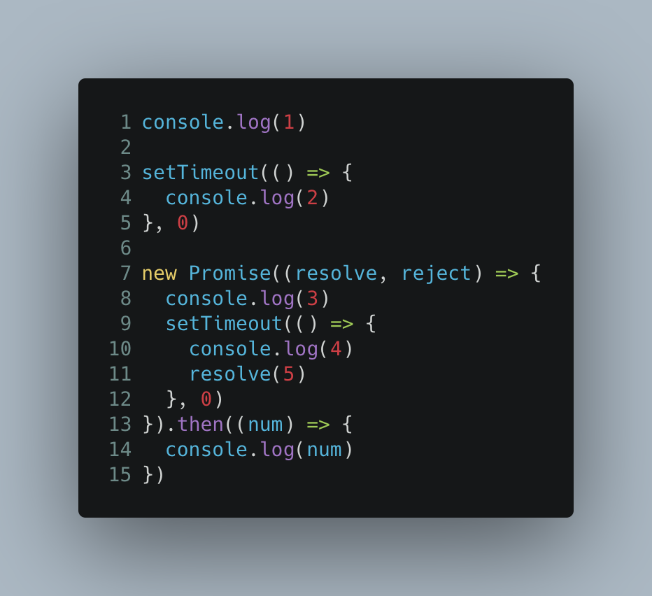
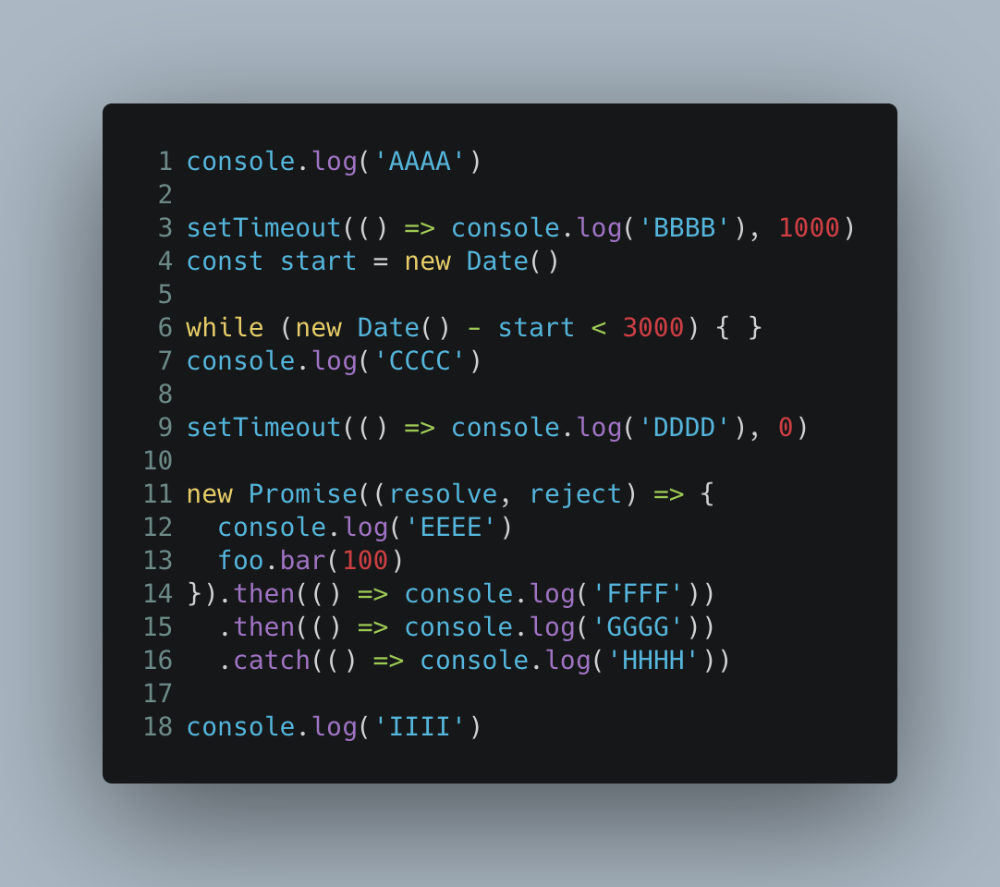

# 宏任务和微任务

> javascript 当中分为宏任务和微任务
> 他们都分别是表示异步任务的两种类型


## 宏任务

> 当前调用栈中执行的代码成为宏任务
> 宏任务包含：

```js
script(整体代码)
setTimeout
setInterval
I/O
UI交互事件
postMessage
MessageChannel
setImmediate(Node.js 环境)
```

## 微任务

> 当前事件循环，在下次宏任务需要执行前需要执行的任务，可以理解为回调函数

> 微任务包含：

```js
Promise.then/catch/finally
Object.observe
MutaionObserver
process.nextTick(Node.js 环境)
```

## 代码执行过程


## 宏任务和微任务之间的关系


## 例子

### 第一个例子

> 在浏览器当中，下面的代码会输出什么内容?




答案解析：

第一次执行：

执行第1行代码输出1、继续往下执行，遇到setTimeout，任务 setTimeout1 加入宏任务队列

执行第7行代码，输出promise内3，遇到第二个setTimeout，任务setTimeout2 加入宏任务队列

当前的宏任务队列中存在 setTimeout1 和 setTimeout2

所以输出了1、3


第二次执行

执行宏任务队列中的 setTimeout1，执行可执行微任务，无可执行的微任务

当前的宏任务的队列存在 setTimeout2


第三次执行

执行宏任务队列中 setTimeout2， 因为resolve，所以当前会存在一个then的微任务，所以继续执行这个then的微任务，所以输出5

所以最后的输出为 1、3、2、4、5


### 第二个例子:

浏览器环境当中，下面的代码会输出什么



第一次执行：

执行第一行代码输出第一个 AAAA， 
遇到了第一个setTimeout，setTimeout1加如宏任务队列，继续往下执行while，再次等待之后，往后继续执行输出 CCCC，遇到第二个setTimeout，任务setTimeout2加入宏任务队列，之后遇到new Promise输出了EEEE，且因为后面的foo.bar为定义所以报错，产生微任务catch1，加入微任务队列，
继续执行输出IIII

当前的宏任务队列 setTimeout1、 setTimeout2
当前的微任务队列 catch1

第一轮宏任务执行完毕，把唯一的微任务catch1执行，所以最后输出

AAAA、CCCC、EEEE、IIII、HHHH

第二次执行：

因为之前的while等待了数秒，所以setTimeout1的宏任务优先执行，输出BBBB，没有其余的微任务，继续下一个宏任务

当前的宏任务队列 setTimeout2

第三次执行：

执行setTimeout2任务，输出DDDD

所以最后输出结果为: AAAA、CCCC、EEEE、IIII、HHHH、BBBB、DDDD


## 参考文章

https://blog.csdn.net/namechenfl/article/details/99623700

https://segmentfault.com/a/1190000020225668