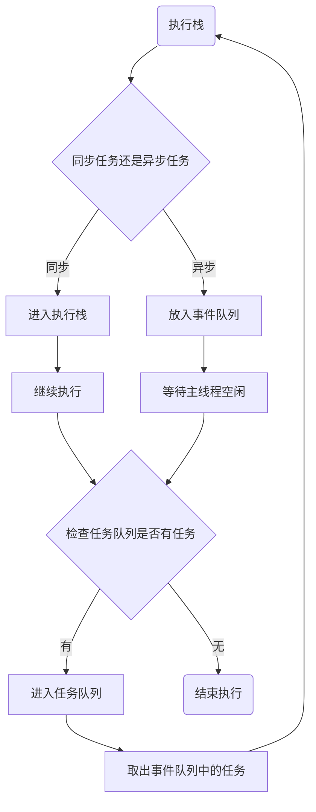

# 异步编程

> 众所周知Javascript是一门单线程的开发语言，这是与它的用途相关，Javascript作为浏览器的脚本语言，需要操作dom，假设Javascript 是多线程的话，一边创建dom，一边删除dom到底以哪个为准就不好说了，因为是单线程，所以造成了代码是同步执行的，这样子更符合我们的阅读和编写习惯

## EventLoop与异步执行机制

> Javascript虽然是单线程的，但是浏览器和服务器却不是单线程的，所以Javascript也具备处理异步任务的能力

> 首先要知道，Javascript分为同步任务和异步任务，同步任务都在主线程(这里的主线程就是JS引擎线程)上执行，会形成一个执行栈。
>
> 一旦执行执行栈空闲，系统就会读取任务队列当中，将可执行的任务添加到执行栈中执行



> Javascript 主线程从任务队列中读取任务到执行栈执行这个过程是循环的，直至任务队列当中全部完成，这个机制我们称为EventLoop

### 宏任务和微任务


> Javascript当中异步任务我们区分为宏任务和微任务，他们都分别是表示异步任务的两种类型

 1. 宏任务包含：

	```js
	script(整体代码)
	setTimeout
	setInterval
	I/O
	UI交互事件
	postMessage
	MessageChannel
	setImmediate(Node.js 环境)
	```

	

 2. 微任务包含：

	```js
	Promise.then/catch/finally
	Object.observe
	MutaionObserver
	process.nextTick(Node.js 环境)
	```

	> 宏任务和微任务的关系

	```mermaid
	graph TD
	
	宏任务 --> 执行结束
	执行结束 --> 有可执行的微任务{有可执行的微任务}
	有可执行的微任务 -- 有 --> 执行所有微任务
	执行所有微任务 -- 开始新的宏任务 --> 宏任务
	有可执行的微任务 -- 没有的话,开始新的宏任务 --> 宏任务
	
	```

宏任务和微任务有点类似于我们平常去银行办理业务的时候，我们需要排队等待等待业务人员叫号办理业务（事件队列），当叫到我们的时候，办理业务这个过程就相当于执行了宏任务，当我们办理完成一个业务的时候，想起来了还有别的一个业务去需要办理的时候，银行业务员不会让你去重新排队，而是会顺便帮你办理完成，而Javascript的过程也是这样子的，当完成宏任务的时候，会去执行当前微任务，再继续执行下一个宏任务

## 异步解决方案

### Callback

解决异步的一个最简单的一个方案就是使用callback，但是callbck这种方案会存在着问题，比如说我们常说的“回调地狱”

例子：

```js
setTimeout(function () {
  var a = '1'
  setTimeout(function () {
    var b = '2,'
    setTimeout(function () {
      var c = '2'
      console.log(a + b + c)
    }, 10)
  }, 10)
}, 10)
```

代码的可读性性和维护性大大降低

### Promise

为了解决一些异步回调嵌套过多的一些问题，形成了回调地狱的问题。 

例子：

```js
setTimeout(function () {
  var a = '1'
  setTimeout(function () {
    var b = '2,'
    setTimeout(function () {
      var c = '2'
      console.log(a + b + c)
    }, 10)
  }, 10)
}, 10)
```

可以使用Promise的来解决这种问题

```js
// 不使用Promise All
const p1 = new Promise((resolve, reject) => {
  setTimeout(() => {
    var a = '1'
    resolve(a)
  }, 10)
}).then(val => {
  return new Promise((resolve, reject) => {
    setTimeout(() => {
      var b = '2'
      resolve(`${val}${b}`)
    }, 10)
  })  
}).then(val => {
  new Promise((resolve, reject) => {
    setTimeout(() => {
      var c = '3'
      console.log(`${val}${c}`)
    }, 10)
  })  
})


// 使用Promise All
const fn1 = function () {
  return new Promise((resolve, reject) => {
    setTimeout(() => {
      var a = '1 '
      resolve(a)
    }, 10)
  })
}

const fn2 = function () {
  return new Promise((resolve, reject) => {
    setTimeout(() => {
      var b = '2,'
      resolve(b)
    }, 10)
  })
}

const fn3 = function () {
  return new Promise((resolve, reject) => {
    setTimeout(() => {
      var c = '3'
      resolve(c)
    }, 10)
  })
}


Promise.all([fn1(), fn2(), fn3()]).then(values => {
  console.log(values[0] + values[1] + values[2])
})
```

这样子我们就形成了一个链式的调用，让我们的代码可读性更高

### Generator、Async/Await

#### Generator

> generator 是ES2015提出的一个异步的解决方案，虽然Promise使用起来很方便，但是代码的可读性使用不如同步代码搞，这个时候Generator就出现了，而著名的Koa第一个版本就是使用了该个方案

例子：

```js
// 使用 * 定义Generator函数
function * foo() {
  console.log('start')
  try {
    const res = yield 'foo'
    console.log(res) // 'bar'
  } catch (e) {
    console.log(e)
  }
}

// 此时这个函数并不会立即执行
const g = foo()

// 当使用了next函数的时候才会去执行
// g.next() 执行会返回一个对象，value就是返回的值，而done表示当前是否完成
g.next() 

// 执行当前的函数会传递给yield返回的值
g.next('bar')

// 也可以抛出一个异常给Generator函数
g.throw(new Error('Generator error'))

```

配合Promise使用Generator

```js
function timeout() {
 return new Promise((resolve, reject) => {
    setTimeout(() => {
      resolve('timeout')
    }, 100)
  })
}


function * main() {
  yield timeout()
}

const g = main()


// 上述返回了一个Promise，所以我们可以使用then函数去取出
g.next().value.then(val => {
  console.log(val)
})
```

我们可以使用Generator写出类似于同步的代码

```js
function timeout() {
 return new Promise((resolve, reject) => {
    setTimeout(() => {
      resolve('1')
    }, 100)
  })
}

function timeout1() {
  return new Promise((resolve, reject) => {
     setTimeout(() => {
       resolve('2')
     }, 100)
   })
 }

 function timeout2() {
  return new Promise((resolve, reject) => {
     setTimeout(() => {
       resolve('3')
     }, 100)
   })
 }


function * main() {
  yield timeout()
  yield timeout1()
  yield timeout2()
}

const g = main()
g.next().value.then(val => console.log(val))
g.next().value.then(val => console.log(val))
g.next().value.then(val => console.log(val))
```

上述代码看起来就像在写同步的代码一样，但是我们可以看到上述的代码，我们g.next()调用了3次，这个时候我们可以使用递归和通过判断done来把这部分处理起来

```js
function timeout() {
 return new Promise((resolve, reject) => {
    setTimeout(() => {
      resolve('1')
    }, 100)
  })
}

function timeout1() {
  return new Promise((resolve, reject) => {
     setTimeout(() => {
       resolve('2')
     }, 100)
   })
 }

 function timeout2() {
  return new Promise((resolve, reject) => {
     setTimeout(() => {
       resolve('3')
     }, 100)
   })
 }


function * main() {
  try {
    const r1 = yield timeout()
    console.log(r1)
    const r2 = yield timeout1()
    console.log(r2)
    const r3 = yield timeout2()
    console.log(r3)
  } catch(e) {
    console.log(e)
  }
}


function co(generator) {
  const g = generator()
  function handleResult (result) {
    // 如果done为true，表示当前Generator所有yield完成可以结束
    if (result.done) return
    // 没有完成的话，继续执行next，这里我们使用递归去完成
    result.value.then(data => {
      handleResult(g.next(data))
    }, error => {
      g.throw(error)
    })
  }
  handleResult(g.next())
}

co(main)
```

上述co函数我们是自己去实现的，在我们日常的开发当中，我们有更完善的库co.js去使用	

### Async/Await

> 使用Generator函数，我们已经获取到了类似于同步开发的体验了，但是我们需要编写一个Generator这样子的执行器，到了ES2017，语言层面提供了Async/Await这样子的语法糖

例子：

```js
function timeout() {
 return new Promise((resolve, reject) => {
    setTimeout(() => {
      resolve('1')
    }, 100)
  })
}

function timeout1() {
  return new Promise((resolve, reject) => {
     setTimeout(() => {
       resolve('2')
     }, 100)
   })
 }

 function timeout2() {
  return new Promise((resolve, reject) => {
     setTimeout(() => {
       resolve('3')
     }, 100)
   })
 }

async function main() {
  try {
    const r1 = await timeout()
    console.log(r1)
    const r2 = await timeout1()
    console.log(r2)
    const r3 = await timeout2()
    console.log(r3)
  } catch(e) {
    console.log(e)
  }
}

main()
```

我们可以看出语法和Generator的语法比较类似的，但是我们不需要使用执行器，而且当使用了async后，return的值也会是一个Promise，await只能在async内部使用


