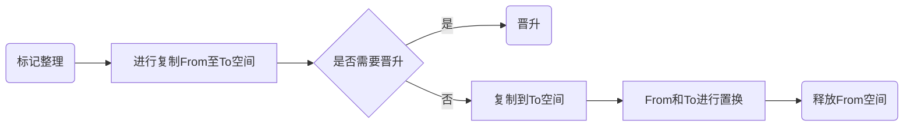
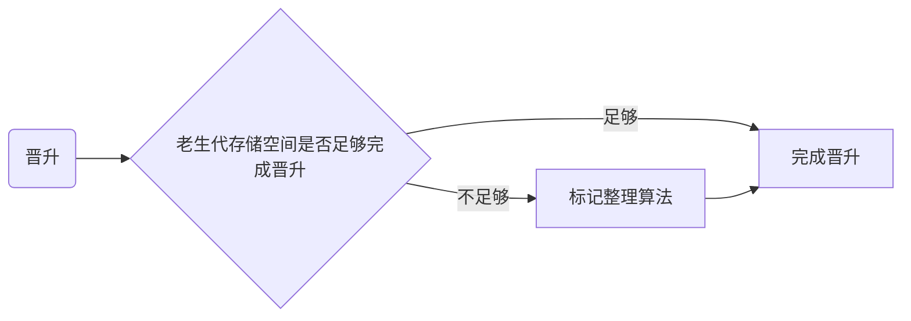

# Javascript内存管理管理机制


## Javascript内存生命周期

> 内存：由可读写单元组成，表示一片可操作空间
>
> 管理：人为的去操作一片空间的申请、使用和释放
>
> 内存管理：开发者主动去申请空间、使用空间、释放空间

内存管理有一些语言会将这种能力开放，比如C语言，也有一些语言会把内存管理的这种能力进行隐藏，比如Javascript，Javascript虽然没有暴露任何内存操作给开发者，但是却默默地自动把所有的管理动作完成

Javascript内存的生命周期其实分为3步


1. 挖坑- 开发者主动去申请空间
2. 用坑- 开发者使用空间
3. 填坑- 释放内存空间

```js
let obj = {} // 定义一个变量，向内存申请了一片空间
obj.name = 'jack' // 使用了申请的内存空间
obj = null // 释放内存空间
```

## 垃圾回收机制

> Javascript中内存管理是自动的
>
> 对象不再被引用时是垃圾
>
> 对象不能从根上访问到时是垃圾

Javascript中内存管理是自动的，每隔一段时间，Javascript就会对变量做“巡检”，当它判断一个变量（如果因为语法等错误，对象也不被访问到）不再被需要之后，它就会把这个变量所占用的内存空间给释放掉，这个过程就叫做垃圾回收

## Javascript中的可达对象

> 可以访问到的对象就是可达对象（引用、作用域链）
>
> 可达的标准就是从根出发是否能被找到
>
> Javascript中的根就可以理解为是全局变量对象

例子：

```js
let obj = { name: 'xm' }
let ali = obj
obj = null
```

1. 当定义了一个obj的对象，可以从根，这里根就是全局变量，那么就可以被认为这是一个可达的对象
2. 再把ali 指向到 obj，这个时候他们指向的值，都是指向同一片的内存地址当中的
3. 再把obj赋值为null，这个时候虽然说ali 和 obj 之间的链接已经断开了，但是我们还是能够通过ali渠道obj的name值，obj这个时候我们还是可以称为可达的对象
4. 假如我们把ali也设置为null

```js
let obj = { name: 'xm' }
let ali = obj
obj = null
ali = null
```

此时我们不能通过任何方法去获取到`name`的值，此时我们就可以把obj称为不可达的对象，此时就会被Javascript当作垃圾进行释放

## GC算法

### 引用计数算法

#### 实现原理

一个对象如果它的引用指针为零就会被当做 “垃圾可回收的”

内部会存在一个引用的计数器，给每一个对象进行引用的计数，当引入之间的关系发生改变的时候，就会进行加1或者减1操作，当某个对象引用数为0的情况下，GC会自动进行内存的回收，引用计数算法的判断是否回收内存，唯一的判断标准就是引用计数值是否为0

例子1:

```js
var a = { name: 'jack' }
```

 `a` 赋值了  `{ name: 'jack' }`，当一个变量指向一个值的，那么创建了一个针对这个值的“引用”，那个计数器，就会给这个值的“引用”加1

```js
a = null
```

而当我们把`a` 重新赋值为`null`的时候这个计数器就会进行减1，那么这个时候GC就会任务这个变量没有再被引用了，就会被作为垃圾进行回收这个“垃圾”的内存。

例子2:

```js
var o1 = {
  o2: {
    x: 1
  }
}
// 2 个对象被创建
// 'o2' 作为 'o1' 的属性被引用
// 没有东西可被垃圾回收

var o3 = o1 // 变量 ‘o3’ 是第二个
            // 有个引用指向 'o1'.

o1 = 1      // 现在，这个最初的'o1'对象拥有一个单独引用，被 'o3' 变量包含着

var o4 = o3.o2 // 这个对象引用 'o2' 属性
                // 它现在有两个引用，一个作为属性，另一个作为 'o4' 变量

o3 = '374' // 在 'o1' 中的原始对象现在是零个引用
            // 它可以被垃圾回收
            // 然而它的 'o2' 属性仍然存在被变量 'o4' 引用，所以不能被释放

o4 = null // 有 'o2' 属性的原始的'o1'对象有零个引用。它现在可以被垃圾回收
```

#### 优缺点

优点：

1. 发现垃圾时立即回收
2. 最大限度减少程序暂停（由于引用计算算法是依据引入数是否为0去判断是否去释放内存的，它是时刻监控着引用，所以只要有“垃圾”，就会立即被释放，不容易因为内存不足而使程序暂停）

缺点：

1. 无法回收循环引用的对象

```js
function fn() {
  const obj1 = {}
  const obj2 = {}
  obj1.name = obj2
  obj2.name = obj1
}
```

两个对象被创建并且相互引用，因此创建了一个循环。在函数调用后，它们将离开作用域，所以它们事实上应该没有用并且要被释放。然而，引用计数算法认为既然两个对象最后一次相互引用了，它们都不会被垃圾回收。

2. 时间开销大（因为当前的引入计算要维护引用数值的变化，所以要时刻监控着这个数值，如果多个对象进行引入关系修改，时间开销会更大）

### 标记清除算法

#### 实现原理

标记清除算法分为标记和清除两个阶段完成，

第一阶段：垃圾收集器会先从根出发，垃圾收集器会扫描遍历所有对象（根节点和子节点），活动对象（可达对象）标记为`”active“`(意味着不是垃圾)

第二阶段：垃圾收集器会遍历所有没有被标记的对象，它会认为是垃圾，释放所有“垃圾”的内存，同时会把释放的空间放到一个空闲列表里面去，方便后面的内存空间进行申请空间使用

#### 优缺点

优点：

解决之前对象引用计算算法的对象循环内存释放问题

缺点：

1. 在释放垃圾的内存空间的，如果释放多个子节点的空间，而根节点的内存空间不是垃圾而不被释放的时候，会造成内存地址的不连续，会造成空间的碎片化
2. 它不会立即回收垃圾的对象，需要等待遍历完所有对象再去进行处理垃圾对象，此时的程序是在暂停的

### 标记整理算法

#### 实现原理

标记整理可以看做是标记清除的增强，标记阶段的操作和标记清除是一样的，但是在第二阶段的时候会先执行整理，移动对象位置，让它们在内存地址上连续，能够最大化的利用内存的空间

#### 优缺点

优点：

减少碎片化的空间

缺点：

不会立即回收垃圾对象

## V8 引擎

### 认识V8

V8 是一款主流的Javascript执行引擎，它能够高效地去运转Javascript的代码

1. V8具备优秀的内存管理机制
2. V8采用了即时编译
3. V8内存设限

#### V8引擎的内存限制

默认情况下，V8引擎在`64`位系统下最多只能使用不超过`1.5GB`的内存，在`32`位系统下最多只能使用不超过`800M`的内存，在这样的限制下，必然会导致在node中无法直接操作大内存对象，那么为什么会有这种限制呢？

1. 回到V8设置之初，起初只是作为浏览器端Javascript的执行环境，在浏览器端我们其实很少会遇到使用大量内存的场景，因此也就没有必要将最大内存设置得过高
2. 垃圾回收本身也是一件非常耗时的操作，假设V8的堆内存为`1.5G`，那么V8做一次小的垃圾回收需要50ms以上，而做一次非增量式回收甚至需要1s以上，可见其耗时之久，而在这1s的时间内，浏览器一直处于等待的状态，同时会失去对用户的响应，如果有动画正在运行，也会造成动画卡顿掉帧的情况，严重影响应用程序的性能。因此如果内存使用过高，那么必然会导致垃圾回收的过程缓慢，也就会导致主线程的等待时间越长，浏览器也就越长时间得不到响应

### V8垃圾回收策略

1. 采用分代回收的思想
2. 内存分为新生代、老生代
3. 针对不同对象采用不同算法

#### V8中常用的GC算法

1. 分代回收
2. 空间复制
3. 标记清除
4. 标记整理
5. 标记增量

#### V8引擎内存空间

V8引擎当中内存空间被一分为二，分别是左侧的新生代（存活时间较短的对象，比如说函数中的局部变量的，当方法执行完后，内存就会被回收）存储空间，这个空间空间是有一定的上限的（32M｜16M），另一侧空间则是老生代存储空间

#### 新生代对象垃圾回收




V8引擎垃圾新生代引擎主要采用复制算法 + 标记整理的算法，在新生代的内存区域当中也被分为了两个相当大小的空间，使用的空间为From，空闲的空间为To，活动对象是存储在From的空间当中，当活动对象被标记完成后，会对内存空间进行整理，当整理过后会把活动对象拷贝至To的空间当中，再进行Form与To空间进行交换，From内的空间进行释放掉。

在拷贝的过程当中可能会出现晋升（晋升就是将新生代的对象移动到老生代的空间），晋升需要满足以下两个条件：

1. 一轮GC还存活的新生代对象
2. To空间的使用率超过25%

#### 老生代垃圾回收

老生代对象（指存活时间较长的对象，比如说全局的变量、闭包存储的一些对象，可能会很长时间）存放在右侧的老生代区域当中，64位操作系统1.4G，32操作系统700M，主要采用标记清除、标记整理、增量标记算法。

首先使用标记清除完成垃圾空间的回收


当新生代对象想向老生代对象区域当中存储对象（晋升），老生代存储空间不足以存储新生代存储区域移动过来的对象的时候，会采用标记整理进行空间的优化



而采用增量标记算法是为了进行效率的优化，在程序的执行过程当中，GC可能会会进行垃圾回收的操作，这个过程当中程序的执行是暂停的，而增量标记的算法，就是把垃圾回收的操作过程拆分为多次进行，组合得去完成此次垃圾回收，让垃圾回收和程序执行交替地去完成，这样子对时间的消耗会更加合理


#### 老生代对象垃圾回收和新生代对象垃圾回收细节对比

1. 新生代区域垃圾回收使用空间换时间，它采用的是一个复制算法，没时没刻都有一个空闲的区域，因为新生代存储区域的空间很小，分出来的空间更小，这一个空间上的使用对于时间上提升是微不足道的

2. 老生代存储区域垃圾回收不适合复制算法，老生代存储区域的空间较大，比如我们一分为2，那么会造成几百M的浪费，老生代存储的对象是比较大的，复制时间会比较消耗时间的，所以不适合采用复制算法

## 内存性能优化

### 内存问题的外在表现（假设当前的网络正常）

1. 页面出现延迟加载或者经常性暂停（频繁的垃圾回收）
2. 页面持续性出现糟糕的性能（内存膨胀）
3. 页面的性能随时间延长越来越差（内存泄漏）

### 界定内存问题的标准

1. 内存泄漏：内存使用持续升高，没看到下降的趋势
2. 内存膨胀：内存膨胀有可能是因为为了更好的用户体验使用了大量的内存，所使用的设备不足以提供这么大的内存，所有为了更精准确定是否是内存膨胀，应在多数设备上进行测试，如都存在性能问题，才能确定是否属于内存膨胀问题
3. 频繁垃圾回收：通过内存变化图进行分析确定问题

### 监控内存的几种方式

1. 浏览器任务管理器
2. Timeline 时序记录
3. 推快照查找分离DOM
4. 判断是否存在频繁的垃圾回收（借助多种工具形成图表，进行判断）

### 什么是分离DOM

界面元素都应该是存活在DOM树上，DOM树上的节点分为以下的形态：

1. 垃圾对象时的DOM节点（DOM节点在DOM树上进行脱离，而且JS代码中没有引用，为称之为垃圾对象）

```html
<body>
  <!-- 当前的div1已经脱离了DOM树，但是并没有JS对它进行引用，这里的div是一个没有意义的div-->
  <div id="div1" style="display:none;">
  </div>
</body>
```


1. 分离状态的DOM节点（DOM节点已经在DOM树上移除了，但是在JS代码中依然有引用）

```html
<body>
  <button id="btn">Add</button>
</body>
<script>
  var tmpEle
  
  function fn() {
    var ul = document.createElement('ul')
    for (var i = 0; i < 10; i++) {
      var li = document.createElement('li')
      ul.appendChild(li)
    }
    tmpEle = ul // 使用了一个变量引用了DOM节点，但是并没有插入进去DOM中，这里就是分离的DOM
  }

  document.getElementById('btn').addEventListener('click', fn, false)

</script>
```

### 为什么要确定频繁的垃圾回收

GC工作时候应用程序时停止，如果当前GC工作过于频繁，而且时间如果过长，会导致应用处于一个假死的壮壮，对于应用用户体验会感受到卡顿，非常的不友好。

可以使用TimeLine中频繁的上升下降和任务管理器中数据频繁的增加减少来确定是否在执行频繁的垃圾回收

### 代码优化

测试Javascript性能的优化，需要采集大量的执行样本进行数学统计和分析, 下面的代码会采用JSBench[https://jsbench.me/]进行代码的测试

#### 全局变量

慎用全局变量

1. 全局的变量定义在全局执行上下文，是所有作用域的域链的顶端，如果定义了一个函数，需要应用到全局变量，会从下往上查找，作用域链长，影响效率
2. 全局执行上下文一直存在于上下文执行栈，不手动去释放，会一直存在内存当中，直到程序结束
3. 如果某个局部作用域出现了同名变量则会遮蔽或污染全局

```js
// 采用了全局作用域
var i, str = ''
for (i = 0; i < 1000; i++) {
  str += i
  console.log(str)
}


// 采用了局部作用域
function fn() {
  let str = ''
  for (let i = 0; i < 1000; i++) {
    str += i
    console.log(str)
  }
}

fn()
```

缓存全局变量

将使用中无法避免的全局变量缓存起来到局部，大量需要使用的全局变量，可以使用局部变量存储起来，使用空间换时间

```html
<body>
  <input type="button" value="btn" id="btn1">
  <input type="button" value="btn" id="btn2">
  <input type="button" value="btn" id="btn3">
  <input type="button" value="btn" id="btn4">
  <p>1111</p>
  <input type="button" value="btn" id="btn5">
  <input type="button" value="btn" id="btn6">
  <p>222</p>
  <input type="button" value="btn" id="btn7">
  <input type="button" value="btn" id="btn8">
  <p>333</p>
  <input type="button" value="btn" id="btn9">
  <input type="button" value="btn" id="btn10">

  <script>
    // 每次从document获取
    function getBtn() {
      let oBtn1 = document.getElementById('btn1')
      let oBtn3 = document.getElementById('btn3')
      let oBtn5 = document.getElementById('btn5')
      let oBtn7 = document.getElementById('btn7')
      let oBtn9 = document.getElementById('btn9')
    }
		
    // 把document存储到局部变量当中
    function getBtn2() {
      let obj = document
      let oBtn1 = obj.getElementById('btn1')
      let oBtn3 = obj.getElementById('btn3')
      let oBtn5 = obj.getElementById('btn5')
      let oBtn7 = obj.getElementById('btn7')
      let oBtn9 = obj.getElementById('btn9')
    }
  </script>

</body>
```

#### 使用原型对象添加方法

使用原型对象添加方法会比使用构造函数添加方法，内存使用上会更好，因为使用构造函数添加方法，每次创建的时候都需要构建一个一样的方法，内存消耗上会更大，但是使用了prototype定义的方法，内存地址当中指向的方法是同一个方法的地址

```js
// 使用构造函数添加方法
var fn1 = function() {
  this.foo = function() {
    console.log(11111)
  }
}
let f1 = new fn1()

// 使用原型对象添加方法
var fn2 = function() {}
fn2.prototype.foo = function() {
  console.log(11111)
}
let f2 = new fn2()
```

#### 避免闭包的陷阱

1. 闭包是一种强大的语法
2. 闭包使用不当很容易出现内存泄漏
3. 不要为了闭包而闭包

闭包在开发当中会经常被使用到，而使用不当可能会造成内存的泄漏，在开发当中使用到闭包的特性的时候，如果进行了频繁的调用，很容易造成内存不释放，造成内存泄漏的问题，应当及时去释放内存

```js
function readData() {
  const buf = Buffer.alloc(1024 * 100)
  let index = 0
  buf.fill('g')  

  return function() {
    index++
    if (index < buf.length) { 
      return buf[index-1]   
    } else {
      buf = null // 清除buf对象，移除当前内存
      return ''
    } 
  }
}

const data = readData()
let next = data()

// 频繁地去重复去调用
while (next !== '') {
  console.log(next)
  next = data()
}
```

#### 避免属性访问方法

1. JS不需要属性的访问方法，所有属性都是外部可见的
2. 使用属性访问器只会增加一层定义，没有访问的控制力

尽量避米使用属性访问方法，使用了属性的访问方法会是作用域链需要往上查找多一层且定义了新的访问方法需要使用更多的内存

```js
// 使用属性访问方法
function Person() {
  this.name = 'icoder'
  this.age = 18
  this.getAge = function() {
    return this.age
  }
}

const p1 = new Person()
const a = p1.getAge()


// 不使用属性访问方法
function Person() {
  this.name = 'icoder'
  this.age = 18
}
const p2 = new Person()
const b = p2.age
```

#### For循环优化

可以通过一些细节，对`For`循环的执行效率更高

减少循环体中活动，把循环体当中一些操作减少了，可以使执行效率更高，因为调用的次数会变得更少

```js
var arrList = [1, 2, 3, 4, 5, 6, 7, 8, 9, 10]

// 每次去执行都会重新获取一次arrList的长度
for (var i = 0; i < arrList.length; i++) {
  console.log(arrList[i])
}

// 提前计算好arrList的长度
let len = arrList.length
for (let i = 0; i < len; i++) {
  console.log(arrList[i])
}
```

选择最优的循环方式

在需要简单遍历数组当中的值的时候，使用`forEach`循环的方式最后，其次是`for`，最后是`for-in`

```js
var arrList = [1, 2, 3, 4, 5, 6, 7, 8, 9, 10]

arrList.forEach(function (item) {
  console.log(item)
})

for (var i = arrList.length; i; i--) {
  console.log(arrList[i])
}

for (var i in arrList) {
  console.log(arrList[i])
}
```

#### 文档碎片优化节点操作

在使用DOM操作节点的时候，一次性插入`DOM`会比逐个插入`DOM`性能更优， 

```js
// 逐个插入 
for (var i = 0; i < 10; i++) {
      var oP = document.createElement('p')
      oP.innerHTML = i 
      document.body.appendChild(oP)
    }

// 使用文档容器插入
 const fragEle = document.createDocumentFragment()
    for (var i = 0; i < 10; i++) {
      var oP = document.createElement('p')
      oP.innerHTML = i 
      fragEle.appendChild(oP)
    }

    document.body.appendChild(fragEle)
```

需要创建一个页面上已经存在的元素样式一样的标签的时候，使用克隆操作比重新创建一样性能更优

```html
<body>
  <p id="box1">old</p>
</body>
<script>
  for (var i = 0; i < 3; i++) {
    var oP = document.createElement('p')
    oP.innerHTML = i 
    document.body.appendChild(oP)
  }

  var oldP = document.getElementById('box1')
  for (var i = 0; i < 3; i++) {
    var newP = oldP.cloneNode(false)
    newP.innerHTML = i 
    document.body.appendChild(newP)
  }
</script>
```

#### 避免使用new Object

`new `在调用的过程会调用 `constructor`操作，相当调用一个函数去创建一个空间，而直接使用字面量的写法相当于直接开辟一个空间去存储数据，执行效率会比更低

```js
const arr1 = [1, 2, 3] // 性能更优

const arr2 = new Array(3)
arr2[0] = 1
arr2[1] = 2
arr2[2] = 3


let test = () => {
  let obj = new Object()
  obj.name = 'zce'
  obj.age = 38
  obj.slogan = '我为前端而活'
  return obj
}

// 性能更优
let test = () => {
  let obj = {
    name: 'zce',
    age: 38,
    slogan = '我为前端而活'
  }
  return obj
}

```

#### 减少判断层级

减少判断的层级之后，使代码需要判断的层级变少了，使代码的执行效率更高

```js
// 优化前
function doSomething (part, chapter) {
  const parts = ['ES2016', '工程化', 'Vue', 'React', 'Node']
  if (part) {
    if (parts.includes(part)) {
      console.log('属于当前的课程')
      if (chapter > 5) {
        console.log('您需要提供 VIP 身份')
      }
    }
  } else {
    console.log('请确认模块信息')
  }
}


// 优化后
function doSomething (part, chapter) {
  const parts = ['ES2016', '工程化', 'Vue', 'React', 'Node']
  if (!part) {
    console.log('请确认模块信息')
    return
  }

  if (!parts.includes(part)) {
    return
  }

  console.log('属于当前的课程')

  if (chapter > 5) {
    console.log('您需要提供 VIP 身份')
  }
}

doSomething('ES2016', 6)
```

#### 减少作用域链查找层级

应当减少作用域链的查找层级，使得代码的执行效率更高，使用局部变量能够减少作用域链的查找，但是可能会增加额外的内存消耗，需要按照具体情况综合考虑

```js
// 优化前
var name = 'zce'

function foo() {
  name = 'zce666'
  function baz() {
    var age = 38
    console.log(age)
    console.log(name)
  }
  baz()
}

// 优化后
var name = 'zce'

function foo() {
  var name = 'zce666'
  function baz() {
    var age = 38
    console.log(age)
    console.log(name)
  }
  baz()
}

foo()
```

#### 减少数据的读取次数

在JS数据读取中，基础数据类型的读取速度会优于引用类型，因为引用类型还需要通过在内存中的地址，查找堆内存当中具体的值，在使用引用类型的对象，可以通过减少层级或者把数据进行缓存是读取的次数减少，从而优化性能

```html
<body>
  <div id="skip" class="skip"></div>
</body>

<script>
  var oBox = document.getElementById('skip')
	
  // 优化前
  function hasEle(ele, cls) {
    return ele.className === cls
  }
  
  // 优化后
  function hasEle(ele, cls) {
    const clsname = ele.className // 把获取到的className存储起来，多次调用后，会有效减少了数据读取的速度
    return clsname === cls
  }

  console.log(hasEle(oBox, 'skip'))
</script>
```

#### 减少声明及语句数

减少一些声明以及语句数，可以减少了我们内存当中的消耗，从而提升效率

```js
// 优化前
const test = (ele) => {
  // 在JS的编译阶段中，需要进行多个变量的创建，还要去获取通过作用域链路查找对应的值，这里所要执行的操作会比下面多，所以执行效率不如下面
  let w = ele.width
  let h = ele.height
  return w * h
}

// 优化后
const test = (ele) => {
  return ele.width * ele.height
}
```

#### 惰性函数

使用了惰性函数之后，因为减少了函数的判断层级，第二次调用后消耗可能会更低，但是在多次调用之后，因为增加了内存的消耗，执行效率会更低

```js
// 普通函数
function addEvent (obj, type, fn) {
  if (obj.addEventListener) {
    obj.addEventListener(type, fn, false)
  } else if (obj.attachEvent) {
    obj.attachEvent('on' + type, fn)
  } else {
    obj['on' + type] = fn
  }
}

// 惰性函数
function addEvent (obj, type, fn) {
  if (obj.addEventListener) {
    addEvent = obj.addEventListener(type, fn, false)
  } else if (obj.attachEvent) {
    addEvent = obj.attachEvent('on' + type, fn)
  } else {
    addEvent = obj['on' + type] = fn
  }
  return addEvent
}


```

#### 使用事件绑定

当我们在处理多个元素进行事件的绑定的时候，会造成大量内存消耗，而使用事件绑定的方式，只给一个元素绑定了事件，可以内存消耗更低

```html
 <body>
   <ul id="ul">
    <li>1</li>
    <li>2</li>
    <li>3</li>
  </ul>
</body>
<script>
  // 优化前
  function showText(event) {
    console.log(event.target.innerHTML)
  }

const list = document.querySelectorAll('li')
for (const item of list) {
  item.onclick = showText
}
  
// 优化后
function showText(event) {
  let obj = event.target
  if (obj.nodeName.toLowerCase() === 'li') {
    console.log(obj.innerHTML)
  }
}
 oUl.addEventListener('click', showText, true)
</script>
```

