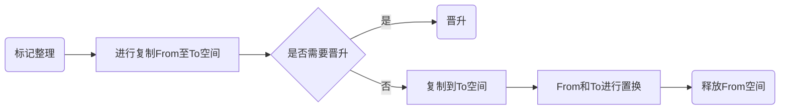
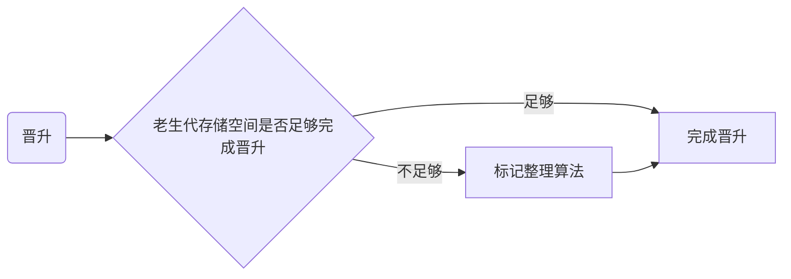

# Javascript内存管理管理机制


## Javascript内存生命周期

> 内存：由可读写单元组成，表示一片可操作空间
>
> 管理：人为的去操作一片空间的申请、使用和释放
>
> 内存管理：开发者主动去申请空间、使用空间、释放空间

内存管理有一些语言会将这种能力开放，比如C语言，也有一些语言会把内存管理的这种能力进行隐藏，比如Javascript，Javascript虽然没有暴露任何内存操作给开发者，但是却默默地自动把所有的管理动作完成

Javascript内存的生命周期其实分为3步

1. 挖坑- 开发者主动去申请空间
2. 用坑- 开发者使用空间
3. 填坑- 释放内存空间

```js
let obj = {} // 定义一个变量，向内存申请了一片空间
obj.name = 'jack' // 使用了申请的内存空间
obj = null // 释放内存空间
```

## 垃圾回收机制

> Javascript中内存管理是自动的
>
> 对象不再被引用时是垃圾
>
> 对象不能从根上访问到时是垃圾

Javascript中内存管理是自动的，每隔一段时间，Javascript就会对变量做“巡检”，当它判断一个变量（如果因为语法等错误，对象也不被访问到）不再被需要之后，它就会把这个变量所占用的内存空间给释放掉，这个过程就叫做垃圾回收

## Javascript中的可达对象

> 可以访问到的对象就是可达对象（引用、作用域链）
>
> 可达的标准就是从根出发是否能被找到
>
> Javascript中的根就可以理解为是全局变量对象

例子：

```js
let obj = { name: 'xm' }
let ali = obj
obj = null
```

1. 当定义了一个obj的对象，可以从根，这里根就是全局变量，那么就可以被认为这是一个可达的对象
2. 再把ali 指向到 obj，这个时候他们指向的值，都是指向同一片的内存地址当中的
3. 再把obj赋值为null，这个时候虽然说ali 和 obj 之间的链接已经断开了，但是我们还是能够通过ali渠道obj的name值，obj这个时候我们还是可以称为可达的对象
4. 假如我们把ali也设置为null

```js
let obj = { name: 'xm' }
let ali = obj
obj = null
ali = null
```

此时我们不能通过任何方法去获取到`name`的值，此时我们就可以把obj称为不可达的对象，此时就会被Javascript当作垃圾进行释放

## GC算法

### 引用计数算法

#### 实现原理

一个对象如果它的引用指针为零就会被当做 “垃圾可回收的”

内部会存在一个引用的计数器，给每一个对象进行引用的计数，当引入之间的关系发生改变的时候，就会进行加1或者减1操作，当某个对象引用数为0的情况下，GC会自动进行内存的回收，引用计数算法的判断是否回收内存，唯一的判断标准就是引用计数值是否为0

例子1:

```js
var a = { name: 'jack' }
```

 `a` 赋值了  `{ name: 'jack' }`，当一个变量指向一个值的，那么创建了一个针对这个值的“引用”，那个计数器，就会给这个值的“引用”加1

```js
a = null
```

而当我们把`a` 重新赋值为`null`的时候这个计数器就会进行减1，那么这个时候GC就会任务这个变量没有再被引用了，就会被作为垃圾进行回收这个“垃圾”的内存。

例子2:

```js
var o1 = {
  o2: {
    x: 1
  }
}
// 2 个对象被创建
// 'o2' 作为 'o1' 的属性被引用
// 没有东西可被垃圾回收

var o3 = o1 // 变量 ‘o3’ 是第二个
            // 有个引用指向 'o1'.

o1 = 1      // 现在，这个最初的'o1'对象拥有一个单独引用，被 'o3' 变量包含着

var o4 = o3.o2 // 这个对象引用 'o2' 属性
                // 它现在有两个引用，一个作为属性，另一个作为 'o4' 变量

o3 = '374' // 在 'o1' 中的原始对象现在是零个引用
            // 它可以被垃圾回收
            // 然而它的 'o2' 属性仍然存在被变量 'o4' 引用，所以不能被释放

o4 = null // 有 'o2' 属性的原始的'o1'对象有零个引用。它现在可以被垃圾回收
```

#### 优缺点

优点：

1. 发现垃圾时立即回收
2. 最大限度减少程序暂停（由于引用计算算法是依据引入数是否为0去判断是否去释放内存的，它是时刻监控着引用，所以只要有“垃圾”，就会立即被释放，不容易因为内存不足而使程序暂停）

缺点：

1. 无法回收循环引用的对象

```js
function fn() {
  const obj1 = {}
  const obj2 = {}
  obj1.name = obj2
  obj2.name = obj1
}
```

两个对象被创建并且相互引用，因此创建了一个循环。在函数调用后，它们将离开作用域，所以它们事实上应该没有用并且要被释放。然而，引用计数算法认为既然两个对象最后一次相互引用了，它们都不会被垃圾回收。

2. 时间开销大（因为当前的引入计算要维护引用数值的变化，所以要时刻监控着这个数值，如果多个对象进行引入关系修改，时间开销会更大）

### 标记清除算法

#### 实现原理

标记清除算法分为标记和清除两个阶段完成，

第一阶段：垃圾收集器会先从根出发，垃圾收集器会扫描遍历所有对象（根节点和子节点），活动对象（可达对象）标记为`”active“`(意味着不是垃圾)

第二阶段：垃圾收集器会遍历所有没有被标记的对象，它会认为是垃圾，释放所有“垃圾”的内存，同时会把释放的空间放到一个空闲列表里面去，方便后面的内存空间进行申请空间使用

#### 优缺点

优点：

解决之前对象引用计算算法的对象循环内存释放问题

缺点：

1. 在释放垃圾的内存空间的，如果释放多个子节点的空间，而根节点的内存空间不是垃圾而不被释放的时候，会造成内存地址的不连续，会造成空间的碎片化
2. 它不会立即回收垃圾的对象，需要等待遍历完所有对象再去进行处理垃圾对象，此时的程序是在暂停的

### 标记整理算法

#### 实现原理

标记整理可以看做是标记清除的增强，标记阶段的操作和标记清除是一样的，但是在第二阶段的时候会先执行整理，移动对象位置，是它们在内存地址上连续，能够最大化的利用内存的空间

#### 优缺点

优点：

减少碎片化的空间

缺点：

不会立即回收垃圾对象

## V8 引擎

### 认识V8

V8 是一款主流的Javascript执行引擎，它能够高效地去运转Javascript的代码

1. V8具备优秀的内存管理机制
2. V8采用了即时编译
3. V8内存设限

#### V8引擎的内存限制

默认情况下，V8引擎在`64`位系统下最多只能使用不超过`1.5GB`的内存，在`32`位系统下最多只能使用不超过`800M`的内存，在这样的限制下，必然会导致在node中无法直接操作大内存对象，那么为什么会有这种限制呢？

1. 回到V8设置之初，起初只是作为浏览器端Javascript的执行环境，在浏览器端我们其实很少会遇到使用大量内存的场景，因此也就没有必要将最大内存设置得过高
2. 垃圾回收本身也是一件非常耗时的操作，假设V8的堆内存为`1.5G`，那么V8做一次小的垃圾回收需要50ms以上，而做一次非增量式回收甚至需要1s以上，可见其耗时之久，而在这1s的时间内，浏览器一直处于等待的状态，同时会失去对用户的响应，如果有动画正在运行，也会造成动画卡顿掉帧的情况，严重影响应用程序的性能。因此如果内存使用过高，那么必然会导致垃圾回收的过程缓慢，也就会导致主线程的等待时间越长，浏览器也就越长时间得不到响应

### V8垃圾回收策略

1. 采用分代回收的思想
2. 内存分为新生代、老生代
3. 针对不同对象采用不同算法

#### V8中常用的GC算法

1. 分代回收
2. 空间复制
3. 标记清除
4. 标记整理
5. 标记增量

#### V8引擎内存空间

V8引擎当中内存空间被一分为二，分别是左侧的新生代（存活时间较短的对象，比如说函数中的局部变量的，当方法执行完后，内存就会被回收）存储空间，这个空间空间是有一定的上限的（32M｜16M），另一侧空间则是老生代存储空间

#### 新生代对象垃圾回收




V8引擎垃圾新生代引擎主要采用复制算法 + 标记整理的算法，在新生代的内存区域当中也被分为了两个相当大小的空间，使用的空间为From，空闲的空间为To，活动对象是存储在From的空间当中，当活动对象被标记完成后，会对内存空间进行整理，当整理过后会把活动对象拷贝至To的空间当中，再进行Form与To空间进行交换，From内的空间进行释放掉。

在拷贝的过程当中可能会出现晋升（晋升就是将新生代的对象移动到老生代的空间），晋升需要满足以下两个条件：

1. 一轮GC还存活的新生代对象
2. To空间的使用率超过25%

#### 老生代垃圾回收

老生代对象（指存活时间较长的对象，比如说全局的变量、闭包存储的一些对象，可能会很长时间）存放在右侧的老生代区域当中，64位操作系统1.4G，32操作系统700M，主要采用标记清除、标记整理、增量标记算法。

首先使用标记清除完成垃圾空间的回收


当新生代对象想向老生代对象区域当中存储对象（晋升），老生代存储空间不足以存储新生代存储区域移动过来的对象的时候，会采用标记整理进行空间的优化



而采用增量标记算法是为了进行效率的优化，在程序的执行过程当中，GC可能会会进行垃圾回收的操作，这个过程当中程序的执行是暂停的，而增量标记的算法，就是把垃圾回收的操作过程拆分为多次进行，组合得去完成此次垃圾回收，让垃圾回收和程序执行交替地去完成，这样子对时间的消耗会更加合理


#### 老生代对象垃圾回收和新生代对象垃圾回收细节对比

1. 新生代区域垃圾回收使用空间换时间，它采用的是一个复制算法，没时没刻都有一个空闲的区域，因为新生代存储区域的空间很小，分出来的空间更小，这一个空间上的使用对于时间上提升是微不足道的

2. 老生代存储区域垃圾回收不适合复制算法，老生代存储区域的空间较大，比如我们一分为2，那么会造成几百M的浪费，老生代存储的对象是比较大的，复制时间会比较消耗时间的，所以不适合采用复制算法

## 


