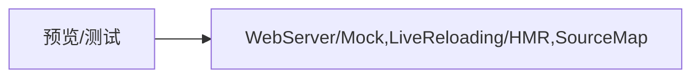
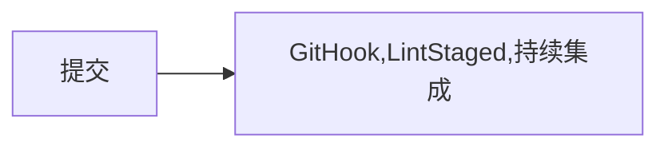

#   前端工程化

## 概念

> 前端工程化，就是将软件工程化的概念用在前端开发当中，其目的是通过工厂化提升【战斗力】

狭义的讲，前端工程化是指将开发阶段的代码转变成生产环境的代码的一系列步骤。主要包括**构建，分支管理，自动化测试，部署**等。

广义的讲，我理解还应该包括开发阶段，其中又包括开发框架搭建，基础工具（请求库、路由库等）选型，视图基础组件库选择等基础工具的选择，这些都确定了之后，剩下的就是编写业务代码。总体来讲，前端开发框架的搭建以及业务代码的编写也是工程化的一部分，也就是说，广义上的前端工程化包括了从开发框架搭建、到业务开发、到测试，再到线上部署的整个链路过程。

## 为什么需要“工程化”

在早期的开发当中，前端的页面都是由各种的后端语言来生成，这个时候前后端界限是极其不分明的，这个时候的前端被称作“切图仔”，而随着`Ajax`的出现，前端出现了`SPA`，前后端开始分离，前后端的指责越来越清晰。

随着前端技术不断发展和演变，各类新的技术层出不从，`Vue`、`React`、`Angular`的出现，不可避免使项目页面的复杂度也越来越高，为了提高工作效率，我们不得不使前端工程化

### 解决的问题

前端工程化是为了提升效率而诞生的，日常的开发当中，我们可能遇到以下的一些问题

1. 想使用ES6+新特性，但是有兼容的问题
2. 想要使用`Less`/`Sass`/`Postcss`增强编程性，但运行环境不能直接支持
3. 想要使用模块化的方式提高项目的可维护性，但运行环境不能直接支持
4. 部署上线前需要手动压缩代码以及资源文件，部署过程需要手动上传代码到服务器
5. 多人协作开发，无法硬性统一大家的代码风格，从仓库中`pull`回来的代码质量无法保证
6. 部分功能开发时需要依赖等待后端服务器接口完成

从以上的问题当中，可以看出前端的工程化可以解决的问题可以含括以下几个过程


### 一切重复性的工作都应当被自动化

创建项目


编码


预览/测试



提交



部署


### 工程化不等于某个工具

软件的工程化不等于某个工具，日常开发当中经常会使用到各种的工具，比如说`webpack`，那么使用了`webpack`是不是就等于实现了前端的工程化呢？不是的，上面说到工程化是一整个工程从创建到部署的整个过程，可能你使用`webpack`仅仅只是解决了编码过程当中的一些问题，所以说工程化不等于某个工具。

现在其实存在着很多成熟的工程化集成脚手架

```bash
vue-cli
creat-react-app
angular-cli
gatsby-cli
```

